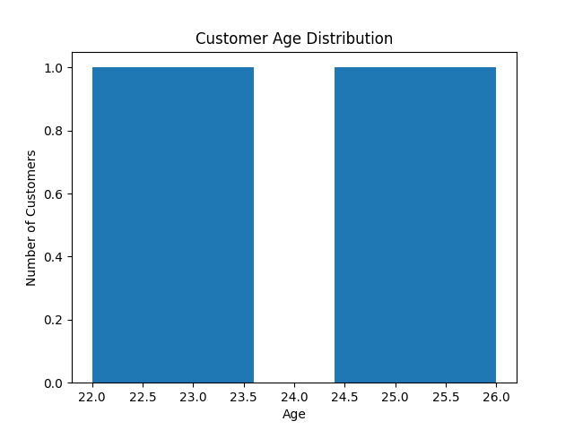
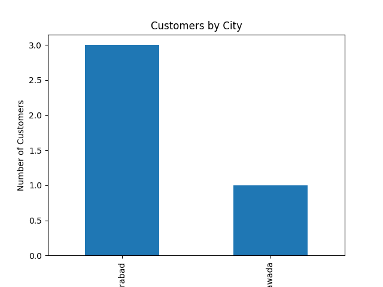

# Exploratory Data Analysis & Business Intelligence

## Dashboard Visualizations

### Customer Age Distribution

### Customers by City

## Key Findings

- Average customer age: 24 years
- Hyderabad has the highest customer count
- Customer ages range from 22 to 26 years
